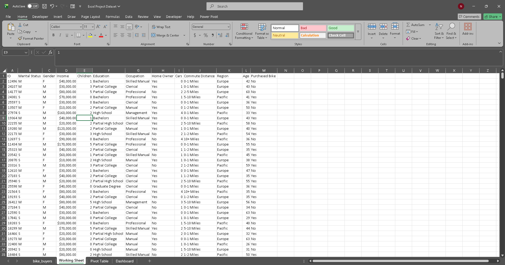
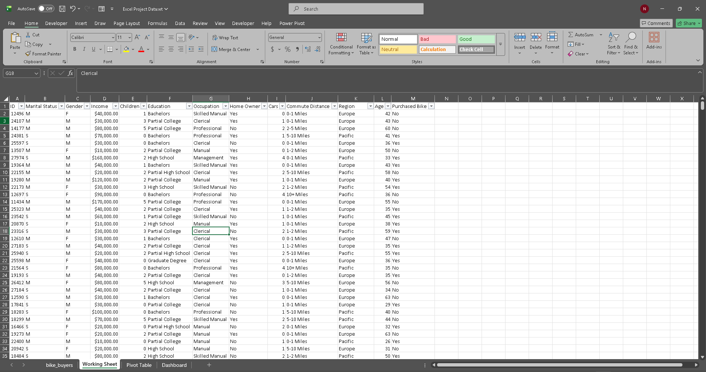
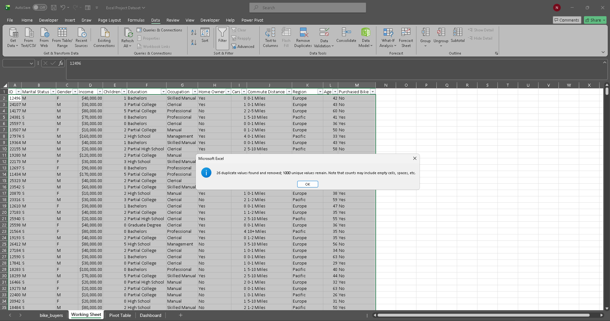
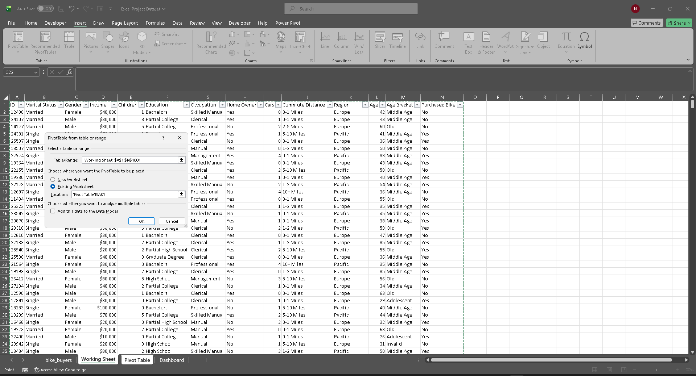
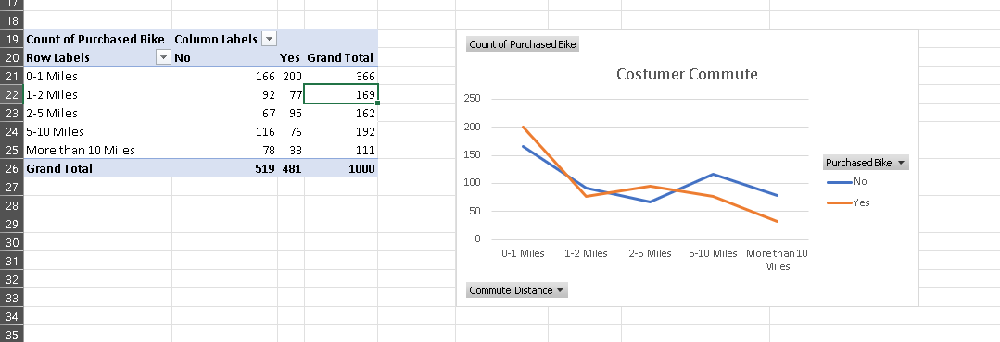

# Excel-DataCleaning-Dashboard-Insight

# Excel Process Logs

1. [Open the datasets](datasets/data/raw_data/Bike_Buyers_Raw.xlsx)  

2. Create Working Sheet , Pivot Table, Dashboard sheet  

---

## Working Sheet

1. Copy raw data into Working Sheet  
   

2. Data overview with filter  
   

3. Remove duplicate from table  
   

4. Spelling out abbreviation  
   

5. Make age bracket based on age column  
   ```excel
   =IF(L2<31,"Adolescent","Invalid")
   =IF(L2>=31,"Middle Age",IF(L2<31,"Adolescent","Invalid"))
   =IF(L2>54,"Old",IF(L2>31,"Middle Age",IF(L2<31,"Adolescent","Invalid")))
   ```
   [Age bracket](assets/images/5.New_field_AgeBracket.png)

---

## Pivot Table

1. Create Pivot table from working sheet  
   

2. Put average income as values, gender as rows, purchased bike as column and create clustered column chart with it  
   

3. Put count of purchased bike as values, commute distance as rows, purchased bike as column and create line chart with it  
   

4. Put count of purchased bike as values, age bracket as rows, purchased bike as column and create line chart with it  
   

5. Copy chart to dashboard sheet  
   

---

## Dashboard

- Create title, arrange dashboard, create slicer and connect them to pivotchart and add insight  
  

